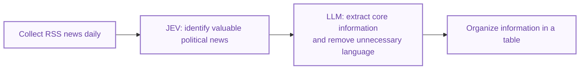

# JEV News

[中文版](README.zh-CN.md)

[Download the latest release](https://github.com/sheng0325/jev-news/releases/latest) · [Installation](INSTALL.md)

I started JEV News because I believe the news we read affects how we think
and what we choose. Everyone has the right to their own views and political
choices. I want to share an idea that helps people understand the news and
decide for themselves.

What angers me is news that stirs up emotions, exploits ethnic or clan
divisions, or dresses political messages in impressive words to manipulate
people. A country's future is decided one vote at a time. If people are being
steered through the information they receive, how free is that choice?

With JEV and LLMs, I hope to make it easier to see what happened, what was
only promised, and what is political packaging. I want to offer information
as fairly and neutrally as I can, without pushing my own politics on readers.
You should be able to look at the facts and make up your own mind.

## API key setup

The repository includes two templates with blank API keys:
[jev_secrets.example.json](jev_secrets.example.json) and
[llm_secrets.example.json](llm_secrets.example.json).
From the project folder, copy them to the local configuration filenames:

```sh
cp -n jev_secrets.example.json jev_secrets.json
cp -n llm_secrets.example.json llm_secrets.json
chmod 600 jev_secrets.json llm_secrets.json
```

The copy commands preserve existing files. Open the two local files and enter
your own API keys, keeping the JSON quotation marks:

| Local file | Field to fill in | API key |
| --- | --- | --- |
| `jev_secrets.json` | `TYPESAFE_API_KEY` | JEV / TypeSafe |
| `llm_secrets.json` | `DEEPSEEK_API_KEY` | DeepSeek (LLM analysis) |

The templates contain no credentials. The local configuration files are ignored
by Git; keep your real keys in those files and leave the committed templates
blank. Other LLM settings use the application's defaults when omitted.
API keys are needed for analysis; viewing saved news does not require them.

## Why JEV

[JEV](https://typesafe.ai/blog/introducing-system-one-models-and-jev) is designed
for fast, low-cost classification and structured judgments. We chose it to
process daily news efficiently and reduce repetitive manual screening.

Here, JEV classifies political relevance, with probabilities indicating support
for each category and confidence indicating certainty in the classification.
It separately scores action specificity, actor attribution, and public
consequence information to assess reading value. LLMs then extract and summarize
the core information.

## Process




## Sources

| Source | Type | Political or institutional context |
| --- | --- | --- |
| Utusan Malaysia | Traditional newspaper | Historically closely linked to UMNO. UMNO relinquished direct control in [2019](https://www.malaysiakini.com/news/463243), and the newspaper later relaunched under new ownership. |
| Malay Mail | Online news outlet with newspaper origins | Centre-right (unverified description). |
| Free Malaysia Today | Online news outlet | No fixed current party alignment established. |
| BERNAMA | News agency | Identifies itself as a [state-owned news agency](https://www.bernama.com/corporate/), with government representatives involved in governance. |

## Limitations

1. **RSS coverage.** Sin Chew Daily, China Press, and Oriental Daily are not
   covered by the current collector. Adding them requires accessible sources.
2. **Language coverage.** Adding these sources would enable comparisons of
   framing and stance across newspapers reporting the same events in different languages.
3. **LLM bias.** We plan to prioritize English sources and prompts.
   [Lim and Röttger (2026, Figure 2, p. 2307)](https://aclanthology.org/2026.findings-eacl.122.pdf#page=7)
   show smaller stance differences between U.S.- and Chinese-origin models with
   English prompts on China-related topics. This does not prove English sources
   or model outputs are unbiased.

## Future work

1. Expand coverage beyond politics to more news categories.
2. Extend the platform to international news.
3. Develop an affordable article quality check using JEV and LLMs. Newsrooms
   could assess drafts before editorial review, helping improve reporting quality
   and reduce review costs while keeping final decisions with editors.

## Reference

Lim, Ying Ying, and Paul Röttger. 2026.
[Bias in the East, Bias in the West: A Bilingual Analysis of LLM Political Bias on U.S.- and China-Related Issues](https://aclanthology.org/2026.findings-eacl.122/).
*Findings of ACL: EACL 2026*, pp. 2301–2326.
DOI: [10.18653/v1/2026.findings-eacl.122](https://doi.org/10.18653/v1/2026.findings-eacl.122).
