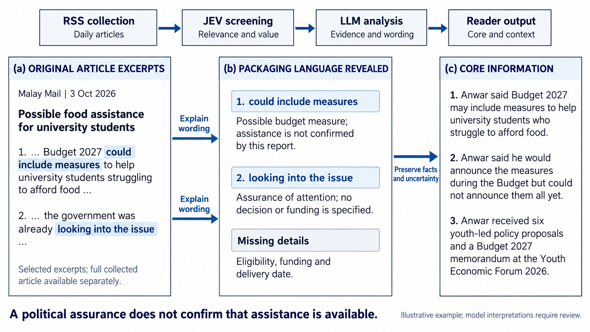

# JEV News

[下载最新版本](https://github.com/sheng0325/jev-news/releases/latest) · [安装说明](INSTALL.zh-CN.md)

[English](README.md)

我做 JEV News，是因为我相信，我们每天接收到的新闻，会影响我们怎么想、怎么选择。每个人都是独立的个体，有自己的想法，也有权作出自己的政治选择。我想分享这个 idea，帮助大家看懂新闻，形成自己的判断。

让我很反感的是，有些新闻用情绪煽动民众，拿族群、宗族课题制造对立，再用漂亮的话包装政治宣传，试图操纵人们的思想。一个国家的未来，是大家一票一票投出来的。如果连我们接收到的资讯都在引导我们接受某种立场，这样的选择又有多自由？

所以，我希望借助 JEV 和 LLM，让大家更容易看清楚：发生了什么，哪些只是承诺，哪些是政治包装。我想尽可能公平、中性地整理信息，不把自己的政治立场塞给读者。大家应该能看到实事求是的信息，再自己决定怎么看、怎么选。

## 为什么使用 JEV

[JEV](https://typesafe.ai/blog/introducing-system-one-models-and-jev) 面向快速、低成本的分类和结构化判断。我们选择它，希望高效处理每日新闻，减少重复性的人工筛选工作。

在本项目中，JEV 判断新闻是否与政治相关，通过各类别的概率量化分类结果的支持程度，并提供分类置信度。它还分别为行动的具体程度、责任主体的明确程度和公共影响信息评分，用于评估阅读价值。随后由 LLM 提取并总结核心信息。

## 流程

## 新闻来源

| 来源 | 类型 | 政治或机构背景 |
| --- | --- | --- |
| Utusan Malaysia | 传统报纸 | 历史上与巫统（UMNO）关系密切。巫统于 [2019 年](https://www.malaysiakini.com/news/463243)放弃直接控制，该报随后在新所有者旗下重新发行。 |
| Malay Mail | 起源于传统报纸的网络新闻媒体 | 中间偏右（尚未核实的描述）。 |
| Free Malaysia Today | 网络新闻媒体 | 尚未确立固定的当前政党倾向。 |
| BERNAMA | 通讯社 | 自称为[国有通讯社](https://www.bernama.com/corporate/)，政府代表参与其治理。 |

## 局限

1. **RSS 覆盖有限。** 当前采集器尚未覆盖《星洲日报》《中国报》和《东方日报》，加入这些报纸需要可用的新闻来源。
2. **语言覆盖有限。** 加入这些来源后，可比较不同语言报纸对同一事件的措辞与立场。
3. **LLM 偏见。** 我们计划优先使用英文来源和提示词。[Lim 与 Röttger（2026，图 2，第 2307 页）](https://aclanthology.org/2026.findings-eacl.122.pdf#page=7)显示，在中国相关议题上，使用英文提示词时，美国与中国开发的模型之间立场差异较小，但这不能证明英文来源或模型输出没有偏见。

## 未来计划

1. 从政治新闻扩展到更多新闻类别。
2. 将平台扩展到国际新闻。
3. 利用 JEV 和 LLM 开发成本较低的稿件质量检查机制，让新闻机构在编辑审核前先评估稿件，帮助提升报道质量、降低审核成本，最终决定仍由编辑作出。

## 参考文献

Lim, Ying Ying, and Paul Röttger. 2026.
[Bias in the East, Bias in the West: A Bilingual Analysis of LLM Political Bias on U.S.- and China-Related Issues](https://aclanthology.org/2026.findings-eacl.122/).
*Findings of ACL: EACL 2026*，第 2301–2326 页。
DOI：[10.18653/v1/2026.findings-eacl.122](https://doi.org/10.18653/v1/2026.findings-eacl.122)。
